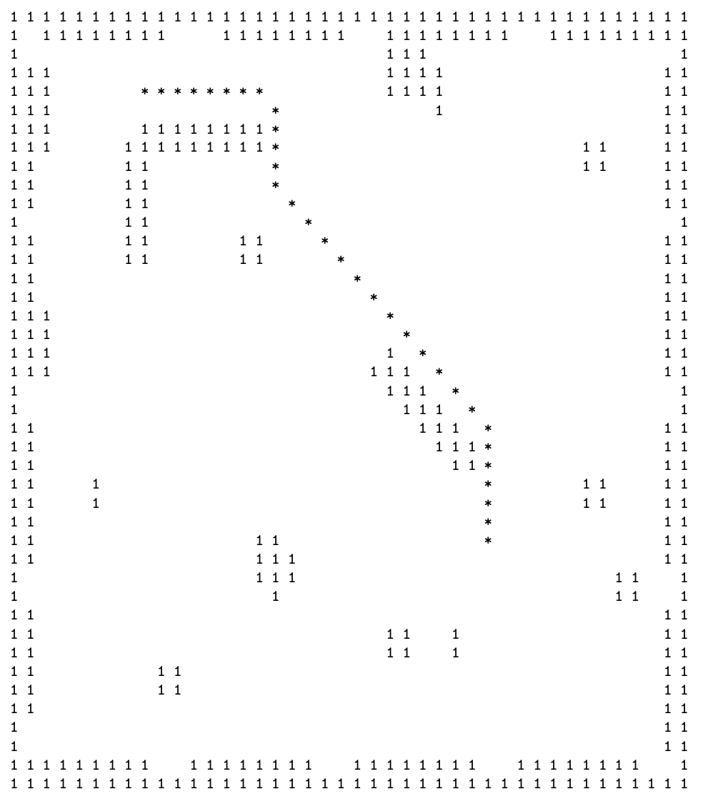

# CSE 468/568 Assignment 5

Authors:  **DeeKay Goswami**


---

# A* Path Planning
**NOTE**: This Assignment has been exported/converted from Python code. Originally coded in Python.
---
## Objective
*The objective of this assignment is to plan a path for a robot from a given starting point to a destination. Download the package from UBlearns. For this assignment, you will be using the same husky environment from previous few lab assignments by running roslaunch husky gazebo husky playpen.launch.
The objective of the assignment is to use A* planning algorithm to find a route from a default start point, e.g. (-8.0, -2.0) to a target goal, e.g. (-5.0, 9.0). Please go through the tutorial on ROS Parameters. The goal should be defined as two parameters goalx and goaly both of which should be of type double. This allows us to set a new goal before launching.
There are a couple of challenges in implementing A* planning as discussed in class. The first challenge is to derive a graph representation of the workspace. This depends on the map representation that the estimation block provides us. Typical examples of such representations are occupancy grids - a grid representation with 1s and 0s with 1 indicating an obstacle in that cell and 0 representing an empty cell. For this assignment, we have provided you such an occupancy grid. It is the file map.txt. It grids the husky playpen world as 0.5m x 0.5m cells. You should import this into your program as the map. You can simply paste the array into your code and read it appropriately as a 2D matrix with dimensions of (42, 42).
The second challenge is the heuristic for the estimated cost between the current node and the goal. Given you know the current location and the goal, you can use Euclidean distance between the current location and the goal as the heuristic cost. ε is the coefficient of the heuristic function, used to scale the heuristic cost. You can start with ε = 1, and tune only if required, based on the paths returned by your A* algorithm.
But how do you know where you are on the map? This is the problem of localization, which we will work on in the next assignment. For now, you will use the global location of the husky robot. This is provided via the topic:
$ /gazebo/link states
which publishes a set of arrays containing the global position of all objects in the world. You will need to find the index of the link named: “/husky/base link”, as the husky’s position corresponds to the index in the Pose array.
Take a look at the message documentation for more info:*

[Gazebo LinkStates](https://docs.ros.org/en/jade/api/gazebo_msgs/html/msg/LinkStates.html)

Path planning and executing the plan should be performed separately. Modularization is the key to the correct implementation. This is why we suggest you split the work into 3 stages.

# 1) Path Planning
You will implement a path planner, that runs only once after launch. You will need:
- The map
- The start position 
- The goal position

# 2) Single Step Execution
In order for your robot to follow a sequence of targets/checkpoints, it should first follow a single step. Given any current position, you should command the robot to move towards its current immediate goal. This should be the coordinates of the center of a cell. This will be an important step, as the robot needs to move from center of a cell, to the center of the next cell to avoid crashing into obstacles that are at the edges. This also depends on the map resolution and the safety margin of the robot size. So you may need to observe the performance, and make changes. We suggest that you keep an internal global variable for the current immediate goal. This way, it can be updated asynchronously in the next stage. Anytime you receive an update on the position of the robot, you can publish the appropriate cmd vel message in the callback, to move the robot towards the current immediate goal.

Test this stage using hardcoded coordinates, and observe the performance. Test to see if you can launch everything by running the command:
```
$ roslaunch lab5 lab5.launch
```

# 3) Full Execution

# Map (Occupancy Grid)

The square of asphalt you see in Gazebo is 20m x 20m, and the map is 21m x 21m to provide a solid wall on all sides. To better see the grid for positioning, you can select View and mark Transparent. Here is an example path on the map.




